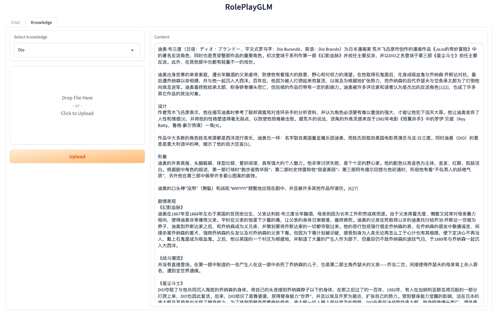

# RolePlayGLM

> 基于ChatGLM-6B使用ptuning进行微调，实现类instruction的效果

## 介绍

由于[ChatGLM-6B](https://github.com/THUDM/ChatGLM-6B)
不支持instruction，所以在进行角色扮演任务时具有不稳定性。本项目通过模板生成超小语料数据集，使用[ptuning](https://github.com/THUDM/ChatGLM-6B/tree/main/ptuning)
进行微调，实现角色扮演的效果。<br>
📜 通过外挂知识库的方式进行角色背景设定。

- Python 3.10

### 示例

#### 基本信息问答


#### 知识库配置



## TODOs

- [X] 基本信息
- [X] 背景设定
- [ ] 性格、情绪

## 使用

1. 安装依赖
    ```shell
    # 安装ChatGLM-6B所需依赖
    $ pip install -r chatglm_6b/requirements.txt
    # 安装ptuning依赖
    $ pip install rouge_chinese nltk jieba datasets
    # 安装本项目所需依赖
    $ pip install -r requirements.txt
    ```

2. 训练模型
   > 可以删除 [train_instruction.sh](train_instruction.sh) 中的```--quantization_bit```参数，不使用量化。
    ```shell
    # 构造数据集
    $ python dataset.py
    # 训练
    $ bash train_instruction.sh
    ```
   从 [Google Drive](https://drive.google.com/file/d/1ZwVht3TVn4GDQ_oxuyQlVP09I7IUmnW6/view?usp=share_link)
   下载已经训练的权重文件，放在 [ckpt](ckpt) 目录下，跳过此步骤。

3. 运行
    ```shell
    $ bash web_demo.sh
    ```

4. 访问
   <br> 浏览器直接打开 [http://127.0.0.1:7860](http://127.0.0.1:7860)

## 硬件

### 推理

| **量化**    | **显存(GB)** |
|-----------|------------|
| FP16（无量化） | 14         |
| INT4      | 6          |

### 训练

| **量化**    | **显存(GB)** | **速度(s/it)** | **loss** |
|-----------|------------|--------------|----------|
| FP16（无量化） | 15         | 6.28         | 0.0021   |
| INT4      | 7          | 8.95         | 0.0012   |

- 以上数据为单张RTX 3090显卡的测试结果
- epoch: 50

## 感谢

- [ChatGLM-6B](https://github.com/THUDM/ChatGLM-6B) 提供基础模型
- [langchain-ChatGLM](https://github.com/imClumsyPanda/langchain-ChatGLM) 提供知识库解决方案
